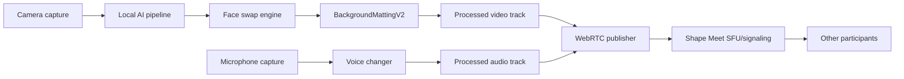

# Shape Meet: stack local para IA en tiempo real

Fecha: 2026-07-02

## Objetivo

Construir una app desktop con Tauri/Rust para Windows 10/11 primero, con soporte futuro para macOS, que haga videollamadas propias y procese localmente:

- face swap realista en vivo;
- cambio de voz en vivo con vcclient000 / w-okada voice-changer;
- background replacement premium;
- salida configurable, con MVP objetivo en 720p30.

La app no debe exponer camara virtual en la primera version. La llamada se hara dentro de Shape Meet usando WebRTC propio.

## Decisiones actuales

### App y videollamada

- Desktop shell: Tauri.
- Core nativo: Rust.
- UI: web frontend dentro de Tauri.
- Llamadas: WebRTC propio, no Zoom/Meet/Teams en MVP.
- Signaling: servicio propio con dominio personalizado.
- Transporte recomendado: LiveKit como SFU base; peer-to-peer solo sirve como optimizacion o MVP 1:1 si no retrasa la arquitectura SFU.
- Procesamiento IA: local en la maquina del usuario con GPU NVIDIA.
- Instalacion: puede ser pesada; se prioriza calidad/estabilidad sobre tamano.
- MVP de llamadas: normalmente 1:1.
- Preparacion para llamadas 3+: mantener arquitectura compatible con SFU desde el inicio.
- Limite inicial de sala: maximo 4 participantes.
- MVP de IA: solo el host aplica face swap.
- Futuro: soportar dos o mas participantes con face swap local simultaneo, cada uno procesando su propio stream en su maquina.
- GPU objetivo: RTX 4070 o superior; objetivo premium RTX 4090/5090, incluyendo variantes laptop.
- macOS futuro: debe correr IA local en Apple Silicon, no solo actuar como cliente ligero.

### Rostro: ruta 1 como principal

Usar ruta FaceFusion / Deep-Live-Cam / InSwapper-like como primer camino practico para foto fuente.

Razon:

- permite face swap desde una foto;
- tiene ecosistema operativo para webcam/realtime;
- es el camino mas corto para validar calidad percibida en 720p30.

Riesgo:

- InSwapper/InsightFace es no comercial sin licencia separada.
- FaceFusion lista INSwapper, RetinaFace y SCRFD como modelos non-commercial.
- InsightFace ofrece licencia enterprise para InSwapper y modelos privados.

Decision:

- usar esta ruta solo si obtenemos licencia comercial de InsightFace o equivalente;
- permitir spikes tecnicos internos en equipos de desarrollo si el uso se mantiene como investigacion/evaluacion no comercial;
- no distribuir builds a clientes con InSwapper/InsightFace preentrenado sin licencia comercial;
- no usar resultados de InSwapper en demos comerciales, ventas o produccion sin resolver licencia;
- encapsular el motor para que el modelo/licencia se pueda cambiar sin tocar UI/WebRTC.

Fuentes:

- https://docs.facefusion.io/introduction/licenses
- https://www.insightface.ai/solutions/face-swapping
- https://github.com/deepinsight/insightface/blob/master/README.md

### Rostro: ruta 2 preparada

Preparar integracion futura con DeepFaceLive / DeepFaceLab DFM para identidades entrenadas.

Uso esperado:

- clientes/rostros de alto valor donde aceptemos un proceso de entrenamiento;
- mejor estabilidad visual para una identidad concreta;
- modelos DFM administrados por nosotros, no carga libre del usuario.

Riesgos:

- DeepFaceLive/DeepFaceLab estan bajo GPL-3.0 y los repos oficiales fueron archivados.
- integrar codigo GPL dentro de una app cerrada es problematico.
- la ruta debe tratarse como motor externo/separado o requerir una alternativa/licencia compatible.

Decision:

- dejar preparada la interfaz de motor `trained_identity`;
- no acoplar el producto principal a codigo GPL hasta resolver legal/licencia;
- documentar flujo de entrenamiento, catalogo de identidades y formato de artefactos.

Fuentes:

- https://github.com/iperov/DeepFacelive
- https://github.com/iperov/DeepFaceLab

### Rostro: ruta 3 documentada para mas adelante

GHOST / GHOST 2.0 queda como ruta open-source mas limpia.

Ventajas:

- GHOST original usa licencia Apache 2.0.
- Permite una historia legal mas limpia que InSwapper.

Costos:

- no viene listo como producto realtime webcam;
- requiere I+D para conversion ONNX/TensorRT, batching, tracking y compositing estable;
- debe probarse si llega a 720p30 con calidad suficiente.

Decision:

- no bloquear MVP con GHOST;
- mantenerlo como spike posterior para reducir dependencia comercial de InsightFace.

Fuentes:

- https://github.com/ai-forever/ghost
- https://github.com/ai-forever/ghost-2.0

### Fondo

Usar BackgroundMattingV2 como ruta principal para fondo premium.

Razon:

- licencia MIT;
- alta calidad de alpha matte;
- reporta 4K30 y HD60 en RTX 2080 Ti;
- encaja con 720p30 en equipos NVIDIA potentes.

Condicion operacional:

- necesita capturar una imagen de fondo limpio sin persona.
- UX requerida: flujo de calibracion "sal de cuadro / captura fondo / vuelve a cuadro".

Fallback:

- NVIDIA Maxine Video Effects SDK puede quedar como alternativa propietaria si BackgroundMattingV2 falla en estabilidad o packaging.

Fuentes:

- https://github.com/PeterL1n/BackgroundMattingV2
- https://grail.cs.washington.edu/projects/background-matting-v2/
- https://docs.nvidia.com/deeplearning/maxine/vfx-sdk-system-guide/index.html

## Arquitectura propuesta



### Topologia de llamada

Para MVP 1:1 se puede usar WebRTC peer-to-peer con signaling propio, siempre que el pipeline de tracks ya este abstraido como si pudiera publicar a una SFU. La decision provisional, sin embargo, es usar LiveKit desde temprano para no rehacer signaling, permisos de sala y publicacion de tracks cuando pasemos a 3-4 participantes.

Para 3+ participantes se debe usar SFU. El stack candidato es:

- LiveKit si queremos avanzar rapido con server, SDKs, TURN/ICE y herramientas listas. Esta es la opcion elegida por ahora.
- mediasoup si queremos control mas bajo nivel y mas trabajo de infraestructura.

Decision: disenar el cliente como `LocalProcessedPublisher`, publicando tracks procesados a LiveKit. El limite funcional inicial sera 4 participantes por sala.

Fuentes:

- https://docs.livekit.io/intro/about/
- https://docs.livekit.io/transport/self-hosting/

### Local AI service

El procesamiento de IA debe vivir en un proceso separado del frontend Tauri.

Responsabilidades:

- cargar modelos;
- validar GPU/CUDA/TensorRT;
- capturar o recibir frames;
- aplicar face swap;
- aplicar background matting;
- devolver frames listos para WebRTC;
- exponer estado de rendimiento: FPS, latencia, VRAM, modelo activo.

Motivo:

- aisla crashes de CUDA/Python;
- permite reemplazar motores;
- facilita empaquetar motores distintos por licencia;
- prepara Windows ahora y macOS despues.

Opciones de implementacion:

- Python daemon para MVP rapido.
- C++/Rust + ONNX Runtime/TensorRT para produccion mas estable.
- IPC local por gRPC, WebSocket local o shared memory. Para video 720p30, shared memory sera preferible cuando el prototipo funcione.

Implementacion actual:

- contrato local inicial en `apps/ai-sidecar`;
- endpoint `GET /health` con estado general y pipelines;
- endpoint `GET /diagnostics` para plataforma, GPU, motores configurados, endpoints externos y límites de payload;
- endpoint `GET /pipelines` para listar motores disponibles;
- endpoint `POST /sessions` para iniciar una sesion de procesamiento por reunion/participante;
- endpoint `GET /sessions/{id}` para consultar FPS, latencia, frames procesados y estado por motor;
- endpoint `POST /sessions/{id}/frames` para recibir un frame local codificado y devolver la salida procesada;
- endpoint `POST /sessions/{id}/audio` para preparar el puente de chunks de voz hacia vcclient000;
- endpoint `DELETE /sessions/{id}` para detener la sesion local;
- Tauri consulta `SHAPE_AI_SERVICE_URL`, por defecto `http://127.0.0.1:7851`;
- `SHAPE_AI_MODE=development-passthrough` valida el transporte sin cargar modelos;
- `SHAPE_FACE_ENGINE`, `SHAPE_BACKGROUND_ENGINE` y `SHAPE_VOICE_ENGINE` seleccionan los adaptadores reales cuando esten instalados;
- `SHAPE_VIDEO_PROCESSOR_ENDPOINT` permite delegar frames a un motor externo FaceFusion/BackgroundMattingV2 sin cambiar LiveKit ni la UI;
- `SHAPE_AUDIO_PROCESSOR_ENDPOINT` permite delegar chunks de voz a vcclient000/w-okada sin cambiar el punto de publicacion de audio;
- el sidecar actual es liviano y no carga modelos; su funcion es fijar el contrato que recibira FaceFusion/DFM, BackgroundMattingV2 y vcclient000;
- Tauri incluye un supervisor nativo para iniciar/detener el sidecar, detectar un sidecar externo, guardar logs locales e incluirlos en el bundle de debug;
- `pnpm build:ai-sidecar` empaqueta el sidecar con PyInstaller en `apps/desktop/src-tauri/binaries/shape-ai-sidecar-${targetTriple}`;
- el mismo build empaqueta el adaptador de comandos como `shape-ai-processor-${targetTriple}` para que los wrappers de modelo puedan correr desde builds Tauri;
- `pnpm build:desktop` regenera ese sidecar y ejecuta `tauri build` con una configuracion local que incluye `bundle.externalBin`;
- PyInstaller no hace cross-compile real: Windows debe construirse en Windows/CI Windows y macOS en macOS/CI macOS.
- el sidecar inicializa `sentry-sdk` si `SENTRY_DSN` existe y reporta errores de adaptadores externos sin adjuntar frames, audio, imagenes fuente ni artefactos.
- `pnpm smoke:ai-contract` levanta procesadores mock y verifica que el sidecar
  delegue video/audio a `SHAPE_VIDEO_PROCESSOR_ENDPOINT` y
  `SHAPE_AUDIO_PROCESSOR_ENDPOINT` con el manifiesto de identidad y flags activos.
- `pnpm smoke:ai-managed` verifica la ruta operativa siguiente: el sidecar
  levanta procesadores locales por `SHAPE_VIDEO_PROCESSOR_COMMAND` y
  `SHAPE_AUDIO_PROCESSOR_COMMAND`, los reporta en diagnostics y delega frame/audio
  a esos procesos. Los wrappers reales de FaceFusion/BackgroundMattingV2 y
  vcclient000 deben exponer el mismo contrato HTTP.
- `pnpm smoke:ai-command` verifica la ruta de adaptadores de comando incluida en
  el repo: el sidecar levanta `shape_processor_command.py`, ese procesador
  ejecuta un comando de modelo por frame/chunk y devuelve el output al pipeline
  WebRTC.

Variables del supervisor nativo:

- `SHAPE_AI_SIDECAR_COMMAND`: comando completo; maxima prioridad.
- `SHAPE_AI_SIDECAR_BIN`: binario empaquetado que acepte `--host` y `--port`.
- `SHAPE_AI_SIDECAR_SCRIPT`: ruta explicita a `server.py`.
- `SHAPE_AI_PYTHON`: interprete Python para desarrollo.
- `SHAPE_VIDEO_PROCESSOR_COMMAND`: comando del wrapper local de video.
- `SHAPE_VIDEO_PROCESSOR_ENDPOINT`: endpoint del wrapper de video; si falta, el
  sidecar usa `http://127.0.0.1:7860/process-frame` cuando hay comando.
- `SHAPE_AUDIO_PROCESSOR_COMMAND`: comando del wrapper local de voz.
- `SHAPE_AUDIO_PROCESSOR_ENDPOINT`: endpoint del wrapper de voz; si falta, el
  sidecar usa `http://127.0.0.1:7861/process-audio` cuando hay comando.
- `SHAPE_VIDEO_FRAME_COMMAND`: comando local invocado por
  `shape_processor_command.py --kind video`. Recibe placeholders `{input}`,
  `{output}`, `{identity}`, `{clean_plate}`, `{width}`, `{height}`, `{fps}` y
  `{session_id}`, ademas de variables `SHAPE_FRAME_*`.
- `SHAPE_AUDIO_CHUNK_COMMAND`: comando local invocado por
  `shape_processor_command.py --kind audio`. Recibe placeholders `{input}`,
  `{output}`, `{sample_rate}`, `{channels}`, `{format}` y `{session_id}`, ademas
  de variables `SHAPE_AUDIO_*`.
- `shape-ai-runtime.env`: archivo local cargado por la app Tauri antes de iniciar
  el sidecar gestionado. Windows usa `%LOCALAPPDATA%\Shape Meet`, macOS usa
  `~/Library/Application Support/Shape Meet` y Linux usa XDG data dir. Puede
  sobreescribirse con `SHAPE_AI_RUNTIME_ENV_FILE`.

Prioridad de arranque: comando explicito, binario explicito, sidecar empaquetado
por Tauri y script de desarrollo.

Comando de desarrollo:

```bash
pnpm dev:ai
```

### Publicacion de tracks procesados

La desktop ya prepara un `MediaStreamTrack` procesado localmente cuando el host
activa rostro o fondo:

- captura camara en 720p30;
- renderiza salida en canvas local limpio, sin overlays de debug dentro del video transmitido;
- envia frames al sidecar cuando existe una sesion IA activa;
- usa el ultimo frame devuelto por el sidecar y cae a camara normal si el sidecar no responde;
- publica ese track a LiveKit como `shape-processed-video`;
- si el pipeline falla, cae a camara normal y muestra el error en `Pipeline local`.

Cuando el host activa voz, la desktop apaga el microfono crudo, crea un track
`shape-processed-audio` con Web Audio y lo publica como fuente `Microphone`.
El pipeline captura PCM mono `pcm_f32le`, lo envia a
`POST /sessions/{id}/audio`, decodifica la respuesta y la inyecta en el track
WebRTC. Si el sidecar, vcclient000 o el formato de respuesta fallan, el mismo
track vuelve a passthrough local del microfono y expone el estado en `Bridge
voz`.

### Contrato para motores externos

El sidecar puede delegar video a `SHAPE_VIDEO_PROCESSOR_ENDPOINT`. Ese endpoint
debe aceptar `POST application/json` con este shape:

```json
{
  "session": {
    "id": "ai_abc123",
    "meetingCode": "SM-123-456",
    "participantId": "p_host",
    "identityId": "identity_exec",
    "mode": "production",
    "target": { "width": 1280, "height": 720, "fps": 30 },
    "warnings": []
  },
  "identity": {
    "id": "identity_exec",
    "kind": "PHOTO_IDENTITY",
    "version": "v1",
    "artifactUri": "https://...",
    "cachedArtifactUri": "https://...",
    "localArtifactPath": "C:\\Users\\...\\identity.bin",
    "artifactSha256": "...",
    "artifactSizeBytes": 123456
  },
  "enabled": { "face": true, "background": true, "voice": false },
  "background": {
    "cleanPlate": {
      "dataUrl": "data:image/jpeg;base64,...",
      "capturedAt": "2026-07-02T15:00:00.000Z",
      "width": 1280,
      "height": 720,
      "cameraDeviceId": "camera_1"
    }
  },
  "target": { "width": 1280, "height": 720, "fps": 30 },
  "frame": {
    "sequence": 1,
    "timestampMs": 1783030000000,
    "width": 1280,
    "height": 720,
    "frameDataUrl": "data:image/jpeg;base64,...",
    "effects": { "face": true, "background": true, "voice": false }
  }
}
```

El endpoint `GET /sessions/{id}` devuelve solo metadata de `background.cleanPlate`
(`ready`, resolucion, hora de captura y camara). El `dataUrl` completo no se
expone en estado de sesion ni se envia a Sentry; solo viaja al procesador local
configurado en `SHAPE_VIDEO_PROCESSOR_ENDPOINT`.

La respuesta debe devolver `frame`:

```json
{
  "frame": {
    "sequence": 1,
    "status": "processed",
    "processor": "facefusion-backgroundmattingv2",
    "frame": {
      "dataUrl": "data:image/jpeg;base64,...",
      "width": 1280,
      "height": 720,
      "format": "image/jpeg"
    },
    "metrics": {
      "fps": 30,
      "latencyMs": 28,
      "framesProcessed": 120,
      "vramMb": 2700,
      "resolution": "1280x720"
    },
    "warnings": []
  }
}
```

El sidecar puede delegar voz a `SHAPE_AUDIO_PROCESSOR_ENDPOINT`. Ese endpoint
recibe `audio.audioDataBase64` con PCM interleaved y debe responder con el mismo
contrato:

```json
{
  "audio": {
    "sequence": 1,
    "status": "processed",
    "processor": "vcclient000",
    "audio": {
      "audioDataBase64": "...",
      "sampleRate": 48000,
      "channels": 1,
      "format": "pcm_f32le"
    },
    "metrics": {
      "chunksProcessed": 40,
      "latencyMs": 18,
      "inputBytes": 8192
    },
    "warnings": []
  }
}
```

El cliente soporta `pcm_f32le`, `pcm_s16le` y `uint8-time-domain` como salida de
voz. Para video, el motor debe devolver una imagen completa del frame final, no
una mascara ni un overlay parcial.

El puente actual usa HTTP/data URL para simplificar el MVP y validar contrato.
Para 720p30 con modelos reales, el siguiente paso tecnico es reemplazar ese
transporte por WebSocket binario, gRPC streaming o memoria compartida sin
cambiar el punto de publicacion a LiveKit.

### Contrato de motores

Todos los motores de rostro deberian cumplir una misma interfaz conceptual:

```text
initialize(config, model_path, license_info)
set_source_identity(identity_id | image_path | trained_model_path)
process_frame(input_frame, timestamp) -> swapped_frame
get_metrics() -> fps, latency_ms, gpu_mem_mb
shutdown()
```

Tipos de identidad:

- `photo_identity`: ruta 1, foto fuente.
- `trained_identity`: ruta 2, modelo entrenado.
- `open_model_identity`: ruta 3 futura.

### Administracion de identidades

Las identidades no seran carga libre del usuario final.

Flujo previsto:

- panel administrativo para crear, aprobar, revocar y pushear identidades;
- panel web construido con Next.js;
- base de datos Postgres;
- ORM Prisma;
- deployment en Coolify usando Dockerfile;
- soporte para identidades desde foto y desde entrenamiento;
- catalogo local sincronizado por usuario/equipo;
- modelos entrenados distribuidos como artefactos versionados;
- UI local solo muestra identidades habilitadas para ese cliente.

Implementacion actual:

- `HostIdentity.status` controla si el rostro esta entrenando, disponible o revocado;
- `HostIdentity.deliveryStatus` controla si el artefacto esta pendiente, listo, publicado o retirado;
- el admin publica con `/api/admin/identities/{id}/delivery`;
- `/api/host/identities` solo devuelve identidades `AVAILABLE` + `PUSHED`;
- `/api/host/identities/{id}/artifact` entrega la URL vigente solo a hosts/admin autorizados;
- la desktop permite seleccionar una identidad publicada antes de entrar a la llamada;
- Tauri descarga o copia artefactos `http(s)`/`file://` a una cache local por identidad y valida `sha256`/tamaño si estan definidos;
- al refrescar identidades, la desktop retira de cache local los artefactos que ya no aparecen autorizados/publicados para ese host;
- el sidecar recibe `identityKind`, `identityVersion`, `identityArtifactUri`, `identityLocalArtifactPath`, `identityArtifactSha256` y `identityArtifactSizeBytes` al iniciar sesion IA.

Puntos de seguridad pendientes:

- firma criptografica de artefactos antes de cargarlos;
- cifrado local de modelos e imagenes fuente;
- auditoria de consentimiento y aprobacion;
- sincronizacion forzada de revocacion local mientras la desktop esta offline.

## Observabilidad y debug

Sentry es una buena opcion para esta etapa, pero debe combinarse con logs locales estructurados y exportacion de debug bundles.

### Capas a instrumentar

1. Frontend Tauri/web.
   - errores JavaScript;
   - promesas rechazadas;
   - errores de permisos de camara/microfono;
   - estado de WebRTC;
   - source maps subidos en builds de debug/staging.

2. Core Rust/Tauri.
   - panics;
   - errores de comandos Tauri;
   - lifecycle de ventanas;
   - Sentry nativo inicializado con `SENTRY_DSN`;
   - evento manual de debug desde la prueba de equipo;
   - bundle JSON exportable con GPU, Sentry, sidecar IA y entorno redactado.
   - permisos del sistema;
   - spawn/stop/restart del AI daemon;
   - tracing estructurado.

3. AI daemon.
   - excepciones Python/C++ wrapper;
   - carga de modelos;
   - version de CUDA/cuDNN/TensorRT/ONNX Runtime;
   - GPU detectada, VRAM libre/usada, driver;
   - latencia por etapa: capture, face detect, swap, matting, encode;
   - FPS real, dropped frames y cola de frames;
   - stdout/stderr de motores externos.

4. WebRTC.
   - ICE state;
   - candidate pair elegido;
   - bitrate, packet loss, jitter, RTT;
   - codec activo;
   - reconexiones;
   - mute/camera permission changes.

5. Voz.
   - modelo activo;
   - sample rate;
   - buffer underruns/overruns;
   - latencia estimada;
   - crash/restart del motor vcclient000.

### Politica de privacidad

Por defecto no se deben enviar frames de video, audio, imagenes fuente ni modelos a Sentry.

Sentry debe recibir:

- errores;
- stack traces;
- breadcrumbs;
- versiones;
- IDs de modelo no reversibles;
- GPU/driver/runtime;
- metricas de rendimiento;
- estado de llamada sin datos personales sensibles.

Para soporte avanzado, la app debe tener un boton "Export debug bundle" que genere un zip local con:

- logs JSONL recientes;
- configuracion no secreta;
- resumen de hardware;
- versiones de modelos/runtimes;
- WebRTC stats;
- ultimos N segundos de metricas de rendimiento;
- crash dumps si existen;
- manifest de permisos.

El bundle no debe incluir video/audio por defecto. Si en algun momento necesitamos capturar frames para diagnostico visual, debe ser opt-in explicito y visible.

### Sentry en el stack

Implementacion recomendada:

- Rust: `sentry` + `sentry-tracing`.
- Frontend: Sentry Browser SDK con source maps de Vite/React.
- Python daemon: `sentry-sdk` con logging integration y tags de runtime.
- Release tracking: mismo `release` para frontend, Rust y daemon.
- Environments: `local-dev`, `internal-debug`, `staging`, `production`.
- Feature flag: `SHAPE_MEET_DEBUG_MODE=1` para logs mas verbosos.

Referencias:

- https://docs.sentry.io/platforms/rust/
- https://github.com/getsentry/sentry-rust
- https://docs.sentry.io/platforms/javascript/sourcemaps/
- https://docs.sentry.io/platforms/python/integrations/logging/
- https://crates.io/crates/tauri-plugin-sentry

### Modo debug inicial

Mientras no tengamos las maquinas Windows NVIDIA definitivas, la app debe poder correr en modo degradado en equipos sin GPU compatible, por ejemplo un Windows con AMD Ryzen 5700G.

Comportamiento esperado:

- abrir UI y flujo de llamada;
- detectar que no hay NVIDIA/CUDA disponible;
- mostrar estado tecnico claro;
- permitir probar permisos, login, panel, seleccion de identidad y signaling;
- usar un mock AI pipeline o passthrough de webcam;
- reportar a Sentry el motivo exacto por el que IA local no esta disponible.

Ejemplo de error interno util:

```text
AI_UNAVAILABLE_CUDA_NOT_FOUND
gpu.vendor=AMD
cuda.available=false
required.min_gpu=RTX_4070
fallback=psthrough_camera
```

## Spikes necesarios antes de UI en Pencil

1. Face swap desde foto en 720p30.
   - probar FaceFusion/InSwapper con licencia o entorno de evaluacion;
   - medir latencia total por frame;
   - evaluar estabilidad en giros, oclusion, expresiones y luz baja.

2. Face swap con identidad entrenada.
   - validar si DFM se puede ejecutar como motor externo sin contaminar licencia de la app;
   - medir calidad vs ruta foto;
   - estimar tiempo de onboarding por identidad.

3. BackgroundMattingV2.
   - probar captura de clean plate;
   - medir calidad de pelo/bordes;
   - medir compositing despues del face swap;
   - validar cambios de iluminacion y silla/objetos moviles.

4. WebRTC propio en Tauri.
   - validar captura/procesamiento/publicacion de track procesado;
   - decidir P2P vs SFU segun numero de participantes;
   - validar dominio personalizado y TURN.

5. Voz.
   - validar vcclient000/w-okada local;
   - medir latencia aceptable para llamada;
   - definir si el audio procesado sale directo al track WebRTC o pasa por pipeline comun.

## Preguntas abiertas

- Resolucion interna de inferencia: procesar rostro a 256/512 y componer en 720p.
- Politica legal/consentimiento para rostros cargados.
- Definir si el limite recomendado para sesiones 3+ sera 4, 6 u 8 participantes.
- Estrategia exacta para Apple Silicon: CoreML/MPS, ONNX Runtime, o motores separados.

## Recomendacion inmediata

Antes de disenar la UI, correr un prototipo tecnico minimo:

- entrada webcam 720p;
- source face desde foto;
- face swap ruta 1;
- BackgroundMattingV2 con clean plate;
- preview local con medicion de FPS/latencia;
- sin WebRTC todavia.

Si este prototipo no sostiene 720p30 con calidad aceptable, cualquier UI quedaria basada en una promesa tecnica debil.
